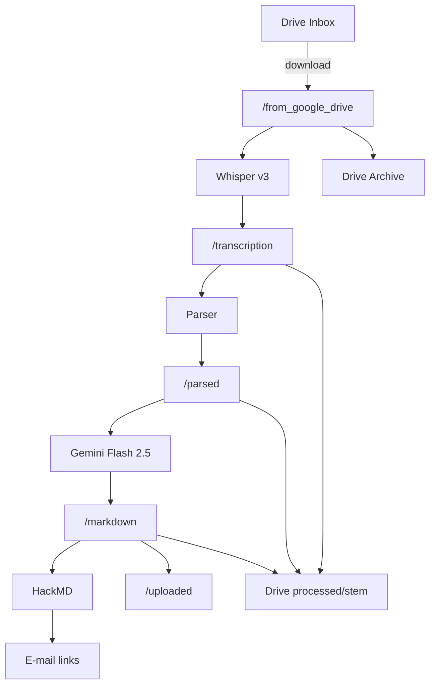

# Whisper-STT Pipeline (Kaggle Edition)

*End-to-end Speech-to-Text ➜ Gemini AI summaries ➜ One-click publishing*

[](#license)

> **Author :** Kuan-Yuan Chen (M.D.)
> **E-mail :** [galen147258369@gmail.com](mailto:galen147258369@gmail.com)

---

## ✨ Main Features

* **Google Drive ingestion** – watches an **Inbox** folder and downloads new audio to the Kaggle runtime.
* **GPU Whisper transcription** – runs **Whisper large-v3** with on-disk model caching (speeds up re-runs).
* **Smart parsing** – re-chunks transcripts every 5 min for cleaner context blocks.
* **Gemini 2.5 Flash summaries** – uses a system prompt stored in **Google Docs** so you can tweak wording without redeploying.
* **HackMD publishing** – creates a public-read note for every summary and tags it `#whisper-stt-project`.
* **E-mail notification** – optional Gmail SMTP that sends you the HackMD links once processing completes.
* **Drive housekeeping** – pushes back `.txt`, `_parsed.txt`, `.md` and archives the original audio, then wipes the Kaggle workspace (model cache survives).

---

## 📂 Google Drive Folder Structure

| Folder name         | Purpose                                                                                  | Folder ID (set in code)             |
| ------------------- | ---------------------------------------------------------------------------------------- | ----------------------------------- |
| `to_be_transcribed` | **Inbox** – drop audio here to process                                                   | `your folder id` |
| `transcribed`       | **Archive** – audio files already processed (moved here by script)                       | `your folder id` |
| `processed data`    | **Outputs** – contains subfolders, each with `.txt`, `_parsed.txt`, `.md` for each audio | `your folder id` |

**Local mapping inside Kaggle:**

```
/kaggle/working
├─ from_google_drive/      # Downloaded audio from 'to_be_transcribed'
├─ transcription/          # Whisper transcript .txt
├─ parsed/                 # 5-minute chunked transcript (_parsed.txt)
├─ markdown/               # Gemini summary Markdown (.md)
└─ uploaded/               # Summaries after HackMD upload
```

---

## 📋 Environment & Prerequisites

* **Run this notebook:**
  📌 You must run `whisper-stt-on-kaggle.ipynb` in a **Kaggle Notebook** (GPU recommended).

* **Python version:** 3.8+ (Kaggle default)

* **Kaggle image:** Default `kaggle/python` Docker image (all key libraries will auto-install).

* **Hardware:** GPU strongly recommended (transcription is much slower on CPU).

* **Google Cloud:**

  * Enable **Google Drive API** and **Google Docs API** for your service account.
  * Share the three Drive folders above with your service account e-mail.

* **Required secrets** (add under *Kaggle ▸ Add-ons ▸ Secrets*):

  | Key              | What to paste                               |
  | ---------------- | ------------------------------------------- |
  | `GDRIVE_SERVICE` | Service account credentials (full JSON key) |
  | `GEMINI_API_KEY` | Gemini Pro/Flash API key                    |
  | `HACKMD_TOKEN`   | HackMD personal access token                |
  | `EMAIL_USER`     | Gmail address (optional)                    |
  | `EMAIL_PASS`     | Gmail App password (optional)               |
  | `EMAIL_TO`       | Where to send report (optional)             |

---

## 🚦 Running the Pipeline

1. **Upload or fork** the notebook to [Kaggle Notebooks](https://www.kaggle.com/code)
2. Set **Accelerator** to **GPU** for best speed.
3. Make sure secrets are configured as above.
4. **Place your audio files** (e.g., `.wav`, `.mp3`, etc.) in the `to_be_transcribed` folder in Google Drive.
5. **Click "Run All"** in the notebook and follow the logs.

---

**Outputs will appear as:**

* **Transcriptions:** `.txt` per audio in `/kaggle/working/transcription/`
* **Chunked transcripts:** `_parsed.txt` in `/kaggle/working/parsed/`
* **AI summaries:** `.md` in `/kaggle/working/markdown/` (and uploaded to HackMD)
* **All processed data is also synced back to your "processed data" folder in Google Drive**

If you enabled email, you will receive a summary of HackMD links when the pipeline finishes.

---

Local mapping inside Kaggle:

```
/kaggle/working
├─ from_google_drive/        ← downloaded audio
├─ transcription/            ← Whisper .txt
├─ parsed/                   ← _parsed.txt (5-min chunks)
├─ markdown/                 ← Gemini summaries (.md)
└─ uploaded/                 ← moved after HackMD upload
```

---

## ⚡ Quick Start

1. **Fork this repo** ➜ open the notebook on **Kaggle** ➜ `Runtime ▸ Accelerator ▸ GPU`.

2. **Enable APIs** in Google Cloud: *Drive API* and *Docs API*.

3. **Add secrets** in *Kaggle ▸ Add-ons ▸ Secrets*

   | Key              | What to paste                      |
   | ---------------- | ---------------------------------- |
   | `GDRIVE_SERVICE` | full JSON key of a Service Account |
   | `GEMINI_API_KEY` | Gemini Pro/Flash API key           |
   | `HACKMD_TOKEN`   | HackMD personal access token       |
   | `EMAIL_USER`     | Gmail address (optional)           |
   | `EMAIL_PASS`     | Gmail App password (optional)      |
   | `EMAIL_TO`       | Where to send the report           |

4. **Edit the three folder IDs** at the top of `pipeline.ipynb` if you changed them.

5. Upload audio ( `.wav`, `.mp3`, … ) to *Inbox* and click **Run All**.

6. Grab transcripts & Markdown in the Drive **processed** folder or open the e-mail with HackMD links.

---

## 🏗 Pipeline – How it Works



## Key implementation details

* **Model cache** lives in `/kaggle/working/whisper_models` – Kaggle persists this between notebook versions, saving \~2 GB download.
* **`new_files` safeguard** – if no new audio is detected, the heavy transcription/summarisation stages are skipped automatically.
* **System prompt** – fetched from a single Google Doc (`DOC_ID`) so non-tech users can update it.
* **Idempotent uploads** – each Markdown file is verified after upload; missing pieces are reported.

---

## 🔧 Configuration

| Variable             | Default                            | Description                                                           |
| -------------------- | ---------------------------------- | --------------------------------------------------------------------- |
| `PREFERRED_LANGUAGE` | `"zh"`                             | Force Whisper to a language (`None` = auto)                           |
| `GENAI_MODEL`        | `"gemini-2.5-flash-preview-05-20"` | swap if you have access to newer models                               |
| `CHUNK_SECONDS`      | `300`                              | length of each parsed block                                           |
| `HAS_EMAIL`          | auto                               | e-mail step is skipped when any of the three mail secrets are missing |

---

## 🩺 Troubleshooting

| Issue                           | Remedy                                                                         |
| ------------------------------- | ------------------------------------------------------------------------------ |
| **Whisper OOM / CUDA error**    | Switch to *T4* or *A100* instance; set `PREFERRED_LANGUAGE=None` to save VRAM. |
| **`HttpError 403` (Drive)**     | Share all three Drive folders with your Service-Account e-mail.                |
| **Gemini 401 / empty response** | Check that billing is enabled for your API key; test with `curl`.              |
| **HackMD 401**                  | Regenerate token in HackMD ▸ Settings ▸ API Token.                             |
| **E-mail not sent**             | Use Gmail App-Password and allow SMTP over SSL :465.                           |

---

## 🤝 Contributing

1. `git checkout -b feat/awesome-idea`
2. `git commit -m "Add awesome idea"`
3. `git push origin feat/awesome-idea` ➜ open a PR.
   Bug reports & feature requests are welcome in Issues.

---

## 📜 License

Released under the **MIT License** – see [`LICENSE`](./LICENSE) for full text.

---

Built with ❤️ to turn **raw voice** ➜ **concise knowledge** in one click.
